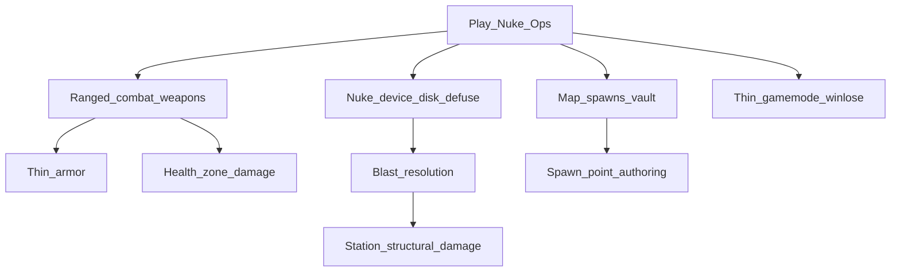

> Goal: A playable Nuclear Operatives round — ops (or proxies) plant/defuse a device; guns and breakable walls matter; on-station syndie spawn is enough
> Status: planned
> Depends on: —
> Current focus: M1 (ranged combat + weapons + thin armor), M2 (station structural damage)

# MVP1 — Nuclear Operatives round

## Playable definition

Done when a small group can run a Nuke Ops–shaped round end-to-end:

- Crew and ops spawn on a authored map (ops may start on-station; shuttle not required)
- Ranged and melee fights resolve through real weapons and enough armor that hits are survivable
- Walls/doors take staged structural damage; a blast can open a route or kill
- Authentication disk + timed nuke device (arm / countdown / defuse); detonation or successful defuse (or timer) ends the round with a legible outcome

Does **not** require full job economy, Traitor uplink, lobby redesign, or shuttle flight.

## Dependency tree

Edges mean “needs.” Leaves cite design / effort / plan — not full HOW.

- **Health zone damage** — largely shipped ([health.md](../design/health.md); [health_implementation_plan.md](../plans/health_implementation_plan.md) Phases 0–5b). Prerequisite for combat leaves, not a current focus leaf.
- **Spawn point authoring** — Map Editor markers shipped ([2026-07_spawn-point-authoring.md](../architecture/2026-07_spawn-point-authoring.md)); runtime job-aware pick still open ([creative-mode.md](../design/creative-mode.md) §8).

## Slices

| Id | Name | Status | Links |
|----|------|--------|-------|
| M0 | Map authoring + spawn tags | partial — authoring shipped; runtime role→spawn pick open | [creative-mode.md](../design/creative-mode.md) §8; [2026-07_spawn-point-authoring.md](../architecture/2026-07_spawn-point-authoring.md) |
| M1 | Combat ranged + dedicated weapons (+ thin armor) | pending — **focus** | [combat.md](../design/combat.md) §3; [armor.md](../design/armor.md); [combat_implementation_plan.md](../plans/combat_implementation_plan.md) Phases 3–5 |
| M2 | Station structural damage model | pending — **focus** | [explosives-destruction.md](../design/explosives-destruction.md) §3; [construction.md](../design/construction.md) §2 (ladder meet); architecture effort TBD when commissioned |
| M3 | Blast + explosive items / nuke device | pending | blocked on M2; [explosives-destruction.md](../design/explosives-destruction.md) §2, §6; [antagonist-content.md](../design/antagonist-content.md) §6 |
| M4 | Thin Nuke Ops gamemode (on-station syndie spawn) | pending | rewrite legacy `NukeGamemode`; [antagonist-content.md](../design/antagonist-content.md) §6; [round-end.md](../design/round-end.md) §2 |
| M5 | MVP1 playable close | pending | depends M0–M4 |

## Explicitly deferred

Off the critical path — do not treat as MVP1 blockers:

- Shuttle as ops spawn/transit gate ([shuttles.md](../design/shuttles.md)) — on-station syndie spawn instead
- Lobby UITK redesign ([lobby.md](../design/lobby.md)) — condemned lobby remains until look is approved; parallel UX track
- Full PDA / uplink / Traitor before MVP1 ([pda.md](../design/pda.md), [antagonist-content.md](../design/antagonist-content.md) §3–4)
- Malf-AI, Revolution, chemistry depth, ship-to-ship combat

## Maintenance

When child work ships, run `update-system-docs`: bump the matching slice status (and this header’s `Current focus`), then refresh [INDEX.md](INDEX.md) **Current focus** to the deepest unfinished critical leaves.
