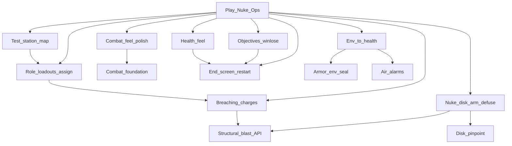

> Goal: A playable Nuclear Operatives round on a small authored test station — ops spawn geared, find/steal/load the disk, arm or defuse the nuke; fights and breaches feel real; environment can kill; round ends with a summary and restarts
> Status: planned
> Depends on: —
> Current focus: M0 (test map + role loadouts), M3 (nuke + disk locator + breaching), M4 (objectives/win-lose), M5 (end screen + restart), M7 (health feel), M8 (env→health + armor seal + air alarms), M1p (combat polish) — multiplayer session stability lives on [test-server.md](test-server.md) T3

# MVP1 — Nuclear Operatives round

## Playable definition

Done when a small group can run a Nuke Ops–shaped round end-to-end on a **basic editor-built test station**:

- Each role (crew + ops) has a **basic spawn loadout** and a way to **assign** it; ops start geared (no uplink this pass)
- Fights are playable without prototype chrome: weapon VFX/decals/blood/sounds, aim IK matches weapon point, two-handed weapon rules, **no hit-debug UI** in normal play
- Crit collapses to ragdoll (not only full unconscious); health screen effects **composite** without stomping each other
- Walls take staged damage; **breaching charges / explosions** open routes via the shipped blast path (somewhat geometry-aware, not a dumb radius)
- Ops have **some way to pinpoint the disk**; disk loads into the nuke; arm / countdown / defuse / detonate
- **Objectives + win/lose** actually resolve
- Spacing / bad air / fire / temperature are **real health risks**; armor seal can protect; **air alarms** fire on bad environment
- Round ends with an **end-game screen** and **restarts** cleanly (shared with test-server loop)

Does **not** require full job economy, Traitor uplink, lobby redesign, shuttle-as-ops-gate, cloning/respawn, Area-id merge on breach, or a finished station sim.

## Dependency tree

Edges mean “needs.” Leaves cite design / effort / plan — not full HOW.

**Shipped foundations** (not focus — do not re-open as blockers):

- **Combat + thin armor absorption** — [combat](../architecture/systems/combat.md); plan Phase 3 + 5. Environmental seal was deferred — now pulled back as **M8**.
- **Structural damage + blast resolve API** — [structural-destruction](../architecture/systems/structural-destruction.md) Phase 1–4. Clearing a wall opens the route; Area-id merge on breach stays out (see deferred).
- **Death → spectator** — ghost detach wired ([entities](../architecture/systems/entities.md)). Full observer stays deferred.

**What still unlocks the round:**

- **Test station + loadouts (M0)** — a small Map Editor station with vault, disk, spawns; per-role `RoleLoadout` + assignment path ([gamemodes-roles-traits](../architecture/systems/gamemodes-roles-traits.md); [2026-07_spawn-point-authoring.md](../architecture/2026-07_spawn-point-authoring.md)).
- **Combat feel (M1p)** — VFX, impact decals, blood on strike, basic weapon audio, aim IK aligned to weapon aim, two-handed use (e.g. no shooting from off-hand alone), strip/hide hit-debug overlays in normal play ([combat.md](../design/combat.md); [audio](../architecture/systems/audio.md)).
- **Health feel (M7)** — ragdoll on crit (not only unconscious); screen-effect intensities composite without mutual wipe ([health](../architecture/systems/health.md); [screen-effects](../architecture/systems/screen-effects.md); [body-presentation-authority](../architecture/2026-07_body-presentation-authority.md)).
- **Nuke loop + disk pinpoint + breaching (M3)** — device/disk interactions + thin ops locator (ping/HUD/item — HOW open); charges/grenades call `ResolveBlast` ([antagonist-content.md](../design/antagonist-content.md) §6; [explosives-destruction.md](../design/explosives-destruction.md) §2, §6; plan Phase 5).
- **Objectives + win/lose (M4)** — thin Nuke Ops mode that actually checks objectives and declares a winner ([antagonist-content.md](../design/antagonist-content.md) §2, §6; rewrite legacy `NukeGamemode`).
- **End screen + restart (M5)** — summary/reveal + return-to-lobby / next round ([round-end.md](../design/round-end.md) §4–§6). **Shared with [test-server.md](test-server.md) T4.**
- **Environment → health + armor seal + air alarms (M8)** — turf O2/pressure/temp/fire feed systemic health; environmental armor seal ([armor.md](../design/armor.md) §3); air alarms when environment is bad ([area.md](../design/area.md) §5 alarms; atmos consumers). Breaches matter because vacuum/gas can kill — without this, blowing a wall is only a corridor.

**Multiplayer stability** (round start/stop, connect/disconnect, graceful server/client handling, no gross host/client desync) is a **test-server / session** gate — see [test-server.md](test-server.md) **T3**, not a separate MVP1 slice. Nuke Ops playtests assume that track is advancing in parallel.

## Slices

| Id | Name | Status | Links |
|----|------|--------|-------|
| M0 | Test station map + vault/disk + role loadouts + assignment | partial — **focus**; spawn markers shipped; runtime pick + `RoleLoadout` wiring + authored playable map open | [creative-mode.md](../design/creative-mode.md) §8; [2026-07_spawn-point-authoring.md](../architecture/2026-07_spawn-point-authoring.md); [id-access.md](../design/id-access.md) §6; [gamemodes-roles-traits](../architecture/systems/gamemodes-roles-traits.md) |
| M1 | Combat ranged + thin armor absorption | shipped | [combat.md](../design/combat.md); [armor.md](../design/armor.md); [combat_implementation_plan.md](../plans/combat_implementation_plan.md) Phase 3 + 5 |
| M1p | Combat feel polish (VFX, decals, blood, sounds, aim IK, two-hand, no debug hit UI) | pending — **focus** | [combat](../architecture/systems/combat.md); [audio](../architecture/systems/audio.md); [entities](../architecture/systems/entities.md) (body/aim) |
| M2 | Structural damage + blast resolve API | shipped | [structural-destruction](../architecture/systems/structural-destruction.md); [station_structural_damage.plan.md](../plans/station_structural_damage.plan.md) Phase 1–4 |
| M3 | Nuke loop + disk pinpoint + breaching/explosions | pending — **focus**; blast API ready; device/disk/locator/items are the work | [antagonist-content.md](../design/antagonist-content.md) §6; [explosives-destruction.md](../design/explosives-destruction.md) §2, §6; plan Phase 5 |
| M4 | Objectives + win/lose (thin Nuke Ops gamemode) | pending — **focus** | [antagonist-content.md](../design/antagonist-content.md) §2, §6; [gamemodes-roles-traits](../architecture/systems/gamemodes-roles-traits.md) |
| M5 | End-game screen + round restart | pending — **focus**; death→spectator wired; summary/restart net-new; **shared with [test-server.md](test-server.md) T4** | [round-end.md](../design/round-end.md) §4–§6 |
| M7 | Health feel (crit ragdoll; screen-effect compositing) | pending — **focus** | [health](../architecture/systems/health.md); [screen-effects](../architecture/systems/screen-effects.md); [2026-07_body-presentation-authority.md](../architecture/2026-07_body-presentation-authority.md) |
| M8 | Env→health + armor seal + air alarms | pending — **focus**; unlocks “breach has consequences” without Area-id merge | [armor.md](../design/armor.md) §3; [health](../architecture/systems/health.md) (LungIntake / exposure); [atmospherics](../architecture/systems/atmospherics.md); [area.md](../design/area.md) §5; [screen-effects](../architecture/systems/screen-effects.md) (temp/fire) |
| M6 | MVP1 playable close | pending | depends M0–M5, M1p, M7, M8 |

## Explicitly deferred

Off the critical path — do not treat as MVP1 blockers:

- **Area-id merge on breach** — passable hole ≠ department merger; corrupts APC/camera/access identity. Atmos *exposure* is M8; Area-id rewrite is not.
- **Full observer/ghost** ([observer.md](../design/observer.md)), **cloning/respawn** ([death-cloning-respawn.md](../design/death-cloning-respawn.md)).
- **Evac shuttle end path** ([round-end.md](../design/round-end.md) §3) — nuke/defuse/timer are MVP1 ends.
- Shuttle as ops spawn gate, lobby UITK redesign, full PDA/uplink/Traitor, structural repair (plan Phase 6), Malf-AI / Revolution / chemistry depth.

## Maintenance

When child work ships, run `update-system-docs`: bump slice status + header `Current focus`, refresh [INDEX.md](INDEX.md). Keep M5 ↔ test-server T4 in sync. Keep session-stability work on test-server T3, not duplicated here. Disk-pinpoint HOW is intentionally thin until commissioned — do not invent a parallel design doc from this milestone.
