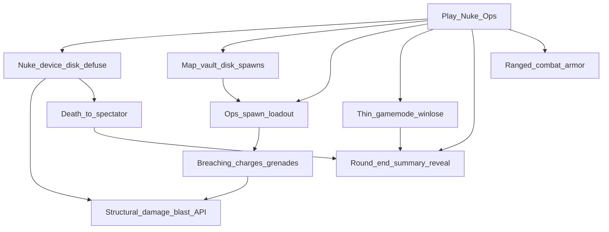

> Goal: A playable Nuclear Operatives round — ops spawn geared, steal/load the disk, arm or defuse the nuke; fight and breaching already work; round ends with a legible outcome
> Status: planned
> Depends on: —
> Current focus: M0 (ops loadout + vault/disk + runtime spawn pick), M3 (nuke device loop), M4 (thin Nuke Ops gamemode), M5 (round-end summary/reveal)

# MVP1 — Nuclear Operatives round

## Playable definition

Done when a small group can run a Nuke Ops–shaped round end-to-end:

- Crew and ops spawn on an authored map (ops may start on-station; shuttle not required), and ops spawn **holding their gear** (no uplink this pass — loadout comes with the spawn)
- Fights resolve through real weapons and enough armor that hits are survivable (foundation shipped)
- Walls can be staged-damaged and blasted open via the existing structural/blast path (foundation shipped) — player **breaching charges / grenades** are content on that path, not a new damage model
- Authentication disk (carryable steal-target in an access-gated vault) + timed nuke: disk must be loaded before arming, then arm / countdown / defuse / detonate
- A killed player **detaches to a spectator** (already wired) rather than stuck at their body
- Detonation, successful defuse, or timer ends the round with a **legible outcome**: summary/reveal over that spectator state

Does **not** require full job economy, Traitor uplink, lobby redesign, shuttle flight, cloning/respawn, or breach-driven atmos/area identity merge.

## Dependency tree

Edges mean “needs.” Leaves cite design / effort / plan — not full HOW.

**Shipped foundations** (not focus — do not re-open as MVP1 blockers):

- **Health + ranged combat + thin armor** — [combat_implementation_plan.md](../plans/combat_implementation_plan.md) Phase 3 + 5; [systems/combat.md](../architecture/systems/combat.md). Environmental seal deferred.
- **Structural damage + blast resolve API** — Phase 1–4 shipped ([structural-destruction](../architecture/systems/structural-destruction.md); [station_structural_damage.plan.md](../plans/station_structural_damage.plan.md)): integrity stages, melee/ranged force, BFS blast, Destroyed→clear, presentation. Admin `hurtstructure` / `blast` exercise the path. Clearing a wall already opens the route (collider gone); Area-id merge on breach is **not** a goal here (see deferred).
- **Death → spectator** — `Human.Kill()` → ghost body already wired ([entities](../architecture/systems/entities.md)). Full observer (dead chat, possession, follow-lock) stays deferred.

**What still unlocks the round:**

- **Nuke device loop (M3)** — the actual Nuke Ops fantasy: disk as steal-target, physical load-into-device gate, arm / visible countdown / defuse, detonate → `EndRound` + `ResolveBlast` ([antagonist-content.md](../design/antagonist-content.md) §6; [explosives-destruction.md](../design/explosives-destruction.md) §6). Legacy `Nuke.cs` / objectives are the rewrite target. Blast *resolution* exists; the device and disk interactions do not.
- **Breaching charges / grenades** — Phase 5 of the structural plan: items that call `ResolveBlast`. Useful ops gear (and can ride M0 loadout), but **secondary** to the nuke loop — not a separate foundation milestone.
- **Ops spawn loadout (M0)** — gear at spawn via legacy `RoleLoadout` / `RoleSubSystem` ([gamemodes-roles-traits](../architecture/systems/gamemodes-roles-traits.md)); uplink/PDA deferred.
- **Vault + disk + runtime spawns (M0)** — map places vault/gated door + disk; Map Editor spawn markers shipped, runtime job/antag-aware pick still open ([2026-07_spawn-point-authoring.md](../architecture/2026-07_spawn-point-authoring.md)).
- **Thin Nuke Ops gamemode (M4)** — assignment, on-station syndie spawn, win/lose; rewrite legacy `NukeGamemode`.
- **Round-end summary/reveal (M5)** — `EndRound` trigger exists; legible reveal + return-to-lobby is net-new ([round-end.md](../design/round-end.md) §4–§6). **Shared with [test-server.md](test-server.md) T4.** Evac (§3) is not MVP1.

## Slices

| Id | Name | Status | Links |
|----|------|--------|-------|
| M0 | Map: vault + disk + runtime spawn pick + ops loadout | partial — **focus**; authoring shipped; runtime role→spawn pick open; ops-at-spawn `RoleLoadout` not wired; vault/disk placement on playable map | [creative-mode.md](../design/creative-mode.md) §8; [2026-07_spawn-point-authoring.md](../architecture/2026-07_spawn-point-authoring.md); [id-access.md](../design/id-access.md) §6; [gamemodes-roles-traits](../architecture/systems/gamemodes-roles-traits.md) (`RoleLoadout`) |
| M1 | Combat ranged + thin armor | shipped | [combat.md](../design/combat.md) §3, §6; [armor.md](../design/armor.md); [combat_implementation_plan.md](../plans/combat_implementation_plan.md) Phase 3 + 5 |
| M2 | Structural damage + blast resolve API | shipped — integrity stages, melee/ranged/blast BFS, Destroyed→clear, VFX; Area/atmos breach consequences explicitly out | [structural-destruction](../architecture/systems/structural-destruction.md); [2026-07_structural-destruction.md](../architecture/2026-07_structural-destruction.md); [station_structural_damage.plan.md](../plans/station_structural_damage.plan.md) Phase 1–4 |
| M3 | Nuke device loop (disk load, arm, countdown, defuse, detonate) + optional breaching items | pending — **focus**; blast API ready; device/disk/items are the work | [antagonist-content.md](../design/antagonist-content.md) §6; [explosives-destruction.md](../design/explosives-destruction.md) §2, §6; plan Phase 5 |
| M4 | Thin Nuke Ops gamemode (assignment, on-station syndie spawn, win/lose) | pending — **focus** | rewrite legacy `NukeGamemode` ([gamemodes-roles-traits](../architecture/systems/gamemodes-roles-traits.md)); [antagonist-content.md](../design/antagonist-content.md) §2, §6 |
| M5 | Round-end summary/reveal (over existing death→spectator) | pending — **focus**; detach wired, summary/reveal net-new; **shared with [test-server.md](test-server.md) T4** | [round-end.md](../design/round-end.md) §4–§6; [observer.md](../design/observer.md) §2, §7; [entities](../architecture/systems/entities.md) |
| M6 | MVP1 playable close | pending | depends M0–M5 |

## Explicitly deferred

Off the critical path — do not treat as MVP1 blockers:

- **Area-id merge / live Area recompute on breach** — opening a hole already makes the tile passable. Auto-merging authored areas (hallway → Medical) corrupts APC/camera/access/alarm identity; that is not a Nuke Ops beat. Design flagged live recompute as an open question ([area.md](../design/area.md) §3); do not pull it in under M2/M3. Atmos zone connect on breach is a separate system with a real play goal — still **not** MVP1 (see MVP2 station-felt loop).
- **Full observer/ghost experience** ([observer.md](../design/observer.md)) — dead chat, possession, ghost-role bodies, follow-lock.
- **Cloning / defib-revive / respawn** ([death-cloning-respawn.md](../design/death-cloning-respawn.md)).
- **Evac shuttle end path** ([round-end.md](../design/round-end.md) §3) — detonation/defuse/timer are MVP1's end triggers.
- Shuttle as ops spawn/transit gate ([shuttles.md](../design/shuttles.md)).
- Lobby UITK redesign ([lobby.md](../design/lobby.md)) — parallel UX track.
- Full PDA / uplink / Traitor ([pda.md](../design/pda.md), [antagonist-content.md](../design/antagonist-content.md) §3–4).
- Structural repair (plan Phase 6) — gated on construction/crafting freeform.
- Malf-AI, Revolution, chemistry depth, ship-to-ship combat.

## Maintenance

When child work ships, run `update-system-docs`: bump the matching slice status (and this header’s `Current focus`), then refresh [INDEX.md](INDEX.md). Keep M5 in sync with test-server T4. Do not resurrect M2 as focus — remaining explosives work is M3 content on the shipped blast API. If atmos-on-breach or a *narrow* Area rule is ever wanted, give it its own slice (likely under MVP2), never smuggle it back into M2.
