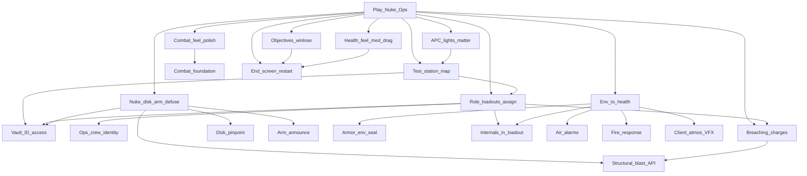

> Goal: A playable Nuclear Operatives round on a small authored test station — ops spawn geared, find/steal/load the disk, arm or defuse the nuke; fights and breaches feel real; environment can kill; round ends with a summary and restarts
> Status: planned
> Depends on: —
> Current focus: M0 (test map + loadouts + access + identity), M1p (combat feel), M3 (nuke loop + locator + breaching + arm announce), M4 (objectives/win-lose), M5 (end screen + restart + spectator), M7 (drag body/carrier remainder), M8 (armor seal + internals + air alarms + fire response), M9 (station power/lights + readable damage) — session softlocks / doors-under-MP / admin wedge tools / smoke happy-path live on [test-server.md](test-server.md) T3–T4

# MVP1 — Nuclear Operatives round

## Playable definition

Done when a small group can run a Nuke Ops–shaped round end-to-end on a **basic editor-built test station**:

- Each role (crew + ops) has a **basic spawn loadout** (including **ammo/mags**, **ID that matches vault/door access**, **defuse tools** for eng/CE, **internals** with env seal) and a way to **assign** it; ops start geared (no uplink)
- **Ops vs crew identity** is readable at a glance (gear / IFF / nameplate) so friendly fire isn’t the default outcome
- Fights are playable without prototype chrome: weapon VFX/decals/blood/sounds, aim IK matches weapon point, two-handed rules, reload/empty cues, knockdown recovery clarity, sprint/stamina usable under armor weight, **no hit-debug or other debug chrome** in normal play; hit feedback is diegetic (no floating damage numbers)
- Crit collapses to ragdoll; health screen effects **composite**; thin field medicine can stabilize; bodies/disk carriers can be **dragged**
- Walls take staged damage (readable at range); **breaching charges / explosions** open routes; APC brownout / dark rooms can matter on the test map
- Ops have **some way to pinpoint the disk**; disk is behind a **real vault gate**; nuke + disk are map-placed; load/defuse are interruptible; **arm announces** to the station; countdown/state readable via examine / object
- **Objectives + win/lose** actually resolve
- Spacing / bad air / fire / temperature are **real health risks**; armor seal + internals protect; **air alarms** fire on bad environment; basic fire response exists
- Round ends with an **end-game screen** ghosts can still see, then **restarts** cleanly

Does **not** require full job economy, Traitor uplink, lobby redesign, shuttle-as-ops-gate, cloning/respawn, Area-id merge on breach, full radio/PDA, chemistry, or a finished station sim.

## Dependency tree

Edges mean “needs.” Leaves cite design / effort / plan — not full HOW.

**Shipped foundations** (not focus — do not re-open as blockers):

- **Combat + thin armor absorption** — [combat](../architecture/systems/combat.md); plan Phase 3 + 5. Environmental seal pulled back as **M8**.
- **Structural damage + blast resolve API** — [structural-destruction](../architecture/systems/structural-destruction.md) Phase 1–4.
- **Death → spectator** — ghost detach wired ([entities](../architecture/systems/entities.md)). Full observer stays deferred.
- **Client atmos VFX (Phase 1)** — dirty-chunk sync shipped ([2026-07_atmos-client-visualization-sync.md](../architecture/2026-07_atmos-client-visualization-sync.md)). Pure clients already see fog/fire/plasma; late-join bootstrap/AOI is Phase 2 polish, not an MVP1 blocker. Do **not** re-list “wire client atmos VFX” as work.

**What still unlocks the round:**

- **Test station + loadouts + access + identity (M0)** — small Map Editor station with vault, disk, nuke, spawns, APCs/lights; per-role `RoleLoadout` + assignment; ID cards that actually gate the vault; ops/crew readable identity; ammo/mags; eng defuse tools; internals for seal ([gamemodes-roles-traits](../architecture/systems/gamemodes-roles-traits.md); [id-access](../architecture/systems/id-access.md); [2026-07_spawn-point-authoring.md](../architecture/2026-07_spawn-point-authoring.md)).
- **Combat feel (M1p)** — VFX, impact decals, blood, weapon audio, aim IK, two-hand rules, reload/empty cues, knockdown/stagger recovery clarity, sprint usable under encumbrance, strip hit-debug **and** other debug chrome (F2 screen-effects, atmos P-overlay, etc.) from normal play; diegetic hit/kill feedback only ([combat](../architecture/systems/combat.md); [audio](../architecture/systems/audio.md); [screen-effects](../architecture/systems/screen-effects.md)).
- **Health feel + thin med + drag (M7)** — crit ragdoll, screen-effect compositing, personal/hit SFX shipped ([health-env-feel](../architecture/2026-07_health-env-feel.md)); bandage/bleed-stop enough to stabilize; **drag/grab body or disk carrier still open** ([health](../architecture/systems/health.md); [body-presentation-authority](../architecture/2026-07_body-presentation-authority.md)).
- **Nuke loop + locator + breaching + arm announce (M3)** — device/disk interactions; thin ops disk pinpoint; charges call `ResolveBlast`; station-wide arm alert; examine/object state for armed/disk-loaded/time left ([antagonist-content.md](../design/antagonist-content.md) §6; [explosives-destruction.md](../design/explosives-destruction.md) §2, §6–§7).
- **Objectives + win/lose (M4)** — thin Nuke Ops mode that checks objectives and declares a winner.
- **End screen + restart + spectator (M5)** — summary/reveal ghosts can still see; return-to-lobby / next round ([round-end.md](../design/round-end.md) §4–§6). **Shared with [test-server.md](test-server.md) T4.**
- **Env→health remainder (M8)** — turf exposure shipped; still need environmental armor seal ([armor.md](../design/armor.md) §3), air alarms that **actually alarm**, extinguisher / thin fire counter; internals ride M0 loadouts ([health](../architecture/systems/health.md); [atmospherics](../architecture/systems/atmospherics.md)).
- **Station power / readable damage (M9)** — test-map APCs drive lights so brownout is free intel; wall damage stages readable at range on authored prefabs ([area](../architecture/systems/area.md); [electricity](../architecture/systems/electricity.md); [structural-destruction](../architecture/systems/structural-destruction.md)).

**On the test-server track (not duplicated as MVP1 slices):** round-start assignment that can’t fail silently; latejoin without softlock; doors/airlocks reliable for remote clients; host admin wedge tools (force-end, reassign, teleport disk); smoke covering spawn→fight→breach→arm→end→restart; performance floor on the test station. See [test-server.md](test-server.md) **T3 / T4**.

## Slices

| Id | Name | Status | Links |
|----|------|--------|-------|
| M0 | Test station + vault/disk/nuke + role loadouts (ammo, ID/access, defuse tools, internals) + assignment + ops/crew identity | partial — **focus** | [creative-mode.md](../design/creative-mode.md) §8; [2026-07_spawn-point-authoring.md](../architecture/2026-07_spawn-point-authoring.md); [id-access](../architecture/systems/id-access.md); [gamemodes-roles-traits](../architecture/systems/gamemodes-roles-traits.md) |
| M1 | Combat ranged + thin armor absorption | shipped | [combat.md](../design/combat.md); [combat_implementation_plan.md](../plans/combat_implementation_plan.md) Phase 3 + 5 |
| M1p | Combat feel polish (VFX, decals, blood, sounds, aim IK, two-hand, reload cues, knockdown clarity, sprint, no debug chrome) | pending — **focus** | [combat](../architecture/systems/combat.md); [audio](../architecture/systems/audio.md); [entities](../architecture/systems/entities.md); [stamina](../architecture/systems/stamina.md) |
| M2 | Structural damage + blast resolve API | shipped | [structural-destruction](../architecture/systems/structural-destruction.md); plan Phase 1–4 |
| M3 | Nuke loop + disk pinpoint + breaching + arm announce + examine state | pending — **focus** | [antagonist-content.md](../design/antagonist-content.md) §6; [explosives-destruction.md](../design/explosives-destruction.md) §2, §6–§7; plan Phase 5 |
| M4 | Objectives + win/lose (thin Nuke Ops gamemode) | pending — **focus** | [antagonist-content.md](../design/antagonist-content.md) §2, §6; [gamemodes-roles-traits](../architecture/systems/gamemodes-roles-traits.md) |
| M5 | End-game screen + round restart + spectator sees outcome | pending — **focus**; **shared with [test-server.md](test-server.md) T4** | [round-end.md](../design/round-end.md) §4–§6; [entities](../architecture/systems/entities.md) |
| M7 | Health feel (crit ragdoll; screen-effect compositing; personal/hit SFX) + thin field med + drag body/carrier | partial — feel polish shipped ([health-env-feel](../architecture/2026-07_health-env-feel.md)); drag still open | [health](../architecture/systems/health.md); [screen-effects](../architecture/systems/screen-effects.md); [audio](../architecture/systems/audio.md); [2026-07_body-presentation-authority.md](../architecture/2026-07_body-presentation-authority.md) |
| M8 | Env→health + armor seal + internals + air alarms that alarm + thin fire response | partial — turf exposure shipped ([health-env-feel](../architecture/2026-07_health-env-feel.md)); seal/internals/alarms/fire response open | [armor.md](../design/armor.md) §3; [health](../architecture/systems/health.md); [atmospherics](../architecture/systems/atmospherics.md); [area.md](../design/area.md) §5 |
| M9 | Test-map power/lights matter + wall damage readable at range | pending — **focus** | [electricity](../architecture/systems/electricity.md); [area](../architecture/systems/area.md); [structural-destruction](../architecture/systems/structural-destruction.md) |
| M6 | MVP1 playable close | pending | depends M0–M5, M1p, M7–M9 |

## Explicitly deferred

Off the critical path — do not treat as MVP1 blockers:

- **Area-id merge on breach** — passable hole ≠ department merger. Atmos *exposure* is M8; Area-id rewrite is not.
- **Client atmos VFX Phase 2** (late-join bootstrap / AOI) — Phase 1 is enough for playtests; polish later.
- **Full observer/ghost**, **cloning/respawn**, **evac shuttle**, shuttle as ops gate, lobby UITK redesign, full PDA/uplink/Traitor, full radio stack, structural repair (plan Phase 6), chemistry, construction ladder, sec camera HUD, Malf-AI / Revolution.

## Maintenance

When child work ships, run `update-system-docs`: bump slice status + header `Current focus`, refresh [INDEX.md](INDEX.md). Keep M5 ↔ test-server T4 in sync. Keep session softlocks, doors-under-MP, admin wedge tools, and happy-path smoke on test-server T3/T4. Disk-pinpoint and arm-announce HOW stay thin until commissioned — do not invent parallel design docs from this milestone.
