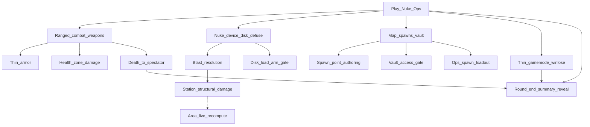

> Goal: A playable Nuclear Operatives round — ops (or proxies) plant/defuse a device; guns and breakable walls matter; on-station syndie spawn is enough
> Status: planned
> Depends on: —
> Current focus: M1 (thin armor after ranged hitscan slice), M2 (station structural damage), M5 (death→spectator + round-end summary — newly surfaced spine)

# MVP1 — Nuclear Operatives round

## Playable definition

Done when a small group can run a Nuke Ops–shaped round end-to-end:

- Crew and ops spawn on a authored map (ops may start on-station; shuttle not required), and ops actually spawn **holding their gear** (no uplink this pass — loadout comes with the spawn)
- Ranged and melee fights resolve through real weapons and enough armor that hits are survivable
- Walls/doors take staged structural damage; a blast can open a route or kill
- Authentication disk (a carryable steal-target sited in an access-gated vault) + timed nuke device: the disk must be loaded before arming succeeds, then arm / countdown / defuse
- A killed player **detaches to a spectator state** rather than being stuck at their body — so a lethal round stays playable through to the end
- Detonation, successful defuse, or timer ends the round with a **legible outcome**: a summary/reveal painted over that spectator state

Does **not** require full job economy, Traitor uplink, lobby redesign, shuttle flight, cloning/respawn, or breach-driven atmos/area consequences.

## Dependency tree

Edges mean “needs.” A dotted edge is a consequence MVP1 deliberately scopes out (see notes).
Leaves cite design / effort / plan — not full HOW.

- **Health zone damage** — largely shipped ([health.md](../design/health.md); [health_implementation_plan.md](../plans/health_implementation_plan.md) Phases 0–5b). Prerequisite for combat leaves, not a current focus leaf.
- **Ranged combat** — hitscan small-arms slice shipped ([combat_implementation_plan.md](../plans/combat_implementation_plan.md) Phase 3; [systems/combat.md](../architecture/systems/combat.md)): accuracy cone, shared `LineOfSight`, M4 mag/reload. Projectile travel still deferred for thrown/heavy. M1 remainder is thin armor ([armor.md](../design/armor.md); combat plan Phase 5).
- **Death → spectator** — the detach itself is **already wired**: `Human.Kill()` transfers the mind into a free-flying ghost body ([entities](../architecture/systems/entities.md); `HumanoidGhostController`). MVP1 needs only that this reads as a clean spectator and that round end has a surface to paint on — **not** the full observer experience (dead chat, possession, ghost-role bodies, follow-lock) which stays deferred ([observer.md](../design/observer.md) §2, §7; [death-cloning-respawn.md](../design/death-cloning-respawn.md) §2).
- **Round-end summary/reveal** — the round-ending *trigger* is already wired in legacy code (`Nuke.Detonate()` → `GamemodeSubSystem.EndRound()`, see [gamemodes-roles-traits](../architecture/systems/gamemodes-roles-traits.md)). What is net-new is the **legible outcome**: reveal + summary painted over the spectator state ([round-end.md](../design/round-end.md) §4, §5), and the return-to-lobby transition (§6). Evac call/countdown (§3) is **not** MVP1 — detonation/defuse/timer are the end paths here.
- **Ops spawn loadout** — antagonist-content routes operative gear through the Traitor uplink ([antagonist-content.md](../design/antagonist-content.md) §6), but uplink/PDA is deferred this pass. MVP1 needs an alternate path: gear the ops at spawn. Legacy `RoleLoadout`/`RoleSubSystem` already models role loadouts ([gamemodes-roles-traits](../architecture/systems/gamemodes-roles-traits.md)); wire ops spawn to it rather than inventing a new mechanism.
- **Vault + disk** — the disk is a carryable steal-target in an access-gated vault ([antagonist-content.md](../design/antagonist-content.md) §6; [id-access.md](../design/id-access.md) §6). Map authoring must place the vault + gated door; inventory (shipped) already carries the disk as an item.
- **Disk-load arm gate** — arming only succeeds once the disk is physically loaded into the device — a distinct interruptible combine step, not part of the timer itself ([antagonist-content.md](../design/antagonist-content.md) §6; [explosives-destruction.md](../design/explosives-destruction.md) §6). Legacy `Nuke.cs` / `DetonateNukeObjective` / `GetItemObjective` are the rewrite target.
- **Spawn point authoring** — Map Editor markers shipped ([2026-07_spawn-point-authoring.md](../architecture/2026-07_spawn-point-authoring.md)); runtime job/antag-aware pick still open ([creative-mode.md](../design/creative-mode.md) §8).
- **Area live-recompute (dotted)** — a Destroyed wall *should* re-flood Area boundaries and connect atmosphere ([explosives-destruction.md](../design/explosives-destruction.md) §4; [area.md](../design/area.md) §3, §5), but Area's live-mutation recompute is **deferred** ([2026-07_area-foundation.md](../architecture/2026-07_area-foundation.md)). MVP1 scopes structural damage to "the tile becomes passable / a route opens" **only** — power/camera/access re-derive and atmos decompression on breach are explicitly out of this gate. Making that boundary explicit keeps it from being a silent blocker on M2/M3.

## Slices

| Id | Name | Status | Links |
|----|------|--------|-------|
| M0 | Map authoring + spawn tags + vault + ops loadout | partial — authoring shipped; runtime role→spawn pick open; ops-at-spawn loadout via legacy `RoleLoadout` not yet wired | [creative-mode.md](../design/creative-mode.md) §8; [2026-07_spawn-point-authoring.md](../architecture/2026-07_spawn-point-authoring.md); [id-access.md](../design/id-access.md) §6 (vault); [gamemodes-roles-traits](../architecture/systems/gamemodes-roles-traits.md) (`RoleLoadout`) |
| M1 | Combat ranged + dedicated weapons (+ thin armor) | partial — ranged hitscan + M4 shipped; thin armor pending | [combat.md](../design/combat.md) §3, §6; [armor.md](../design/armor.md); [combat_implementation_plan.md](../plans/combat_implementation_plan.md) Phase 3 shipped, Phase 5 open |
| M2 | Station structural damage model | pending — **focus**; scoped to route-opening only (no live area/atmos recompute) | [explosives-destruction.md](../design/explosives-destruction.md) §3–§4; [construction.md](../design/construction.md) §2 (ladder meet); [area.md](../design/area.md) §3 / [2026-07_area-foundation.md](../architecture/2026-07_area-foundation.md) (recompute deferred); architecture effort TBD when commissioned |
| M3 | Blast + explosive items / nuke device (incl. disk-load arm gate + defuse) | pending | blocked on M2; [explosives-destruction.md](../design/explosives-destruction.md) §2, §6; [antagonist-content.md](../design/antagonist-content.md) §6 |
| M4 | Thin Nuke Ops gamemode (on-station syndie spawn, assignment, win/lose) | pending | rewrite legacy `NukeGamemode` ([gamemodes-roles-traits](../architecture/systems/gamemodes-roles-traits.md)); [antagonist-content.md](../design/antagonist-content.md) §2, §6 |
| M5 | Round resolution spine: death→spectator + round-end summary/reveal | pending — **focus** (newly surfaced); death detach already wired, summary/reveal net-new; **shared with [test-server.md](test-server.md) T4** | [observer.md](../design/observer.md) §2, §7; [round-end.md](../design/round-end.md) §4–§6; [entities](../architecture/systems/entities.md) (ghost); [gamemodes-roles-traits](../architecture/systems/gamemodes-roles-traits.md) (`EndRound`) |
| M6 | MVP1 playable close | pending | depends M0–M5 |

## Explicitly deferred

Off the critical path — do not treat as MVP1 blockers:

- **Full observer/ghost experience** ([observer.md](../design/observer.md)) — dead chat, possession, ghost-role bodies, follow-lock. MVP1 uses only the existing death→ghost detach as a thin spectator.
- **Cloning / defib-revive / respawn** ([death-cloning-respawn.md](../design/death-cloning-respawn.md)) — dead players stay spectators until round end; no revival path this pass.
- **Breach-driven area & atmos consequences** ([explosives-destruction.md](../design/explosives-destruction.md) §4) — structural damage opens routes only; Area live-recompute stays deferred ([2026-07_area-foundation.md](../architecture/2026-07_area-foundation.md)).
- **Evac shuttle end path** ([round-end.md](../design/round-end.md) §3) — detonation/defuse/timer are MVP1's end triggers.
- Shuttle as ops spawn/transit gate ([shuttles.md](../design/shuttles.md)) — on-station syndie spawn instead.
- Lobby UITK redesign ([lobby.md](../design/lobby.md)) — condemned lobby remains until look is approved; parallel UX track.
- Full PDA / uplink / Traitor before MVP1 ([pda.md](../design/pda.md), [antagonist-content.md](../design/antagonist-content.md) §3–4) — ops gear comes from spawn loadout instead.
- Malf-AI, Revolution, chemistry depth, ship-to-ship combat.

## Maintenance

When child work ships, run `update-system-docs`: bump the matching slice status (and this header’s `Current focus`), then refresh [INDEX.md](INDEX.md) **Current focus** to the deepest unfinished critical leaves. If a scoped-out consequence (area/atmos recompute on breach, cloning, evac) is later pulled in, move it from **Explicitly deferred** into the tree with its own slice rather than letting it creep in silently.
