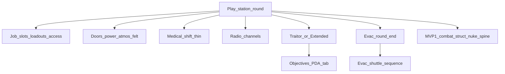

> Goal: A short bare-bones SS13 station shift — jobs, doors/power/atmos that matter, medical save path, Traitor or Extended, round end via timer/admin/evac
> Status: planned
> Depends on: [mvp1-nuke-ops.md](mvp1-nuke-ops.md)
> Current focus: blocked on MVP1

# MVP2 — Bare-bones station round

## Playable definition

Done when players can lobby into ranked job prefs, staff a minimal department set, do recognizable work for a short shift, and end the round without relying only on a nuke detonation:

- Jobs with access presets and spawn loadouts (Captain, Sec, Engineer, Doctor, Cargo, Assistant at minimum)
- Station loop: doors/access, power shedding, atmos as a real threat when breached
- Medical: field treatment + defib window (cloning/cryo latejoin as thin as needed)
- Comms: radio channels on top of local speech
- Traitor slice **or** Extended; objectives + round-end summary
- Evac call / countdown / point-of-no-return as a shared end path

Expand this doc’s tree when MVP1 is in progress; slices below are a sketch only.

## Dependency tree

High-level only — edges mean “needs.” MVP1 combat/structural/blast capability is assumed available.

## Slices

| Id | Name | Status | Links |
|----|------|--------|-------|
| S1 | Job system (bare roster) | pending | [lobby.md](../design/lobby.md); [id-access.md](../design/id-access.md) §5; roles |
| S2 | Station loop felt | pending | [area.md](../design/area.md); [electricity.md](../design/electricity.md); [atmospherics.md](../design/atmospherics.md); id-access doors |
| S3 | Medical shift thin | pending | [health.md](../design/health.md); [death-cloning-respawn.md](../design/death-cloning-respawn.md) |
| S4 | Comms radio | pending | [comms.md](../design/comms.md) |
| S5 | Traitor / Extended + objectives | pending | [antagonist-content.md](../design/antagonist-content.md) §3; [objectives.md](../design/objectives.md); [round-config.md](../design/round-config.md) |
| S6 | Evac end path | pending | [round-end.md](../design/round-end.md) §3; [shuttles.md](../design/shuttles.md) (evac only) |
| S7 | Eng / cargo minimum | pending | electricity repair already partial; [cargo.md](../design/cargo.md) thin or mapped supply |
| S8 | MVP2 playable close | pending | depends S1–S7 + MVP1 |

## Explicitly deferred

- AI / cyborgs, virology, chemistry depth, full crafting rewrite
- Shuttles beyond ops polish + evac
- Persistence of station damage across rounds
- Admin tooling beyond end-round; player accounts
- Lobby visual redesign remains a parallel track (not a silent MVP2 gate unless embark is unusable)

## Maintenance

When child work ships, run `update-system-docs`: bump slice status here and refresh [INDEX.md](INDEX.md) only if MVP2 is the active gate (otherwise leave hub focus on MVP1).
