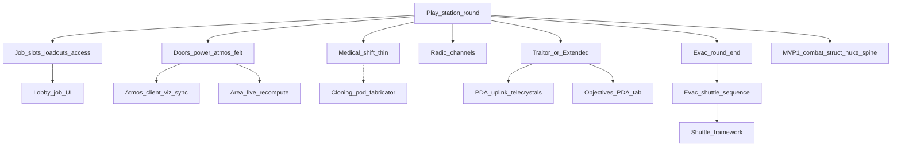

> Goal: A short bare-bones SS13 station shift — jobs, doors/power/atmos that matter, medical save path, Traitor or Extended, round end via timer/admin/evac
> Status: planned
> Depends on: [mvp1-nuke-ops.md](mvp1-nuke-ops.md)
> Current focus: blocked on MVP1

# MVP2 — Bare-bones station round

## Playable definition

Done when players can lobby into ranked job prefs, staff a minimal department set, do recognizable work for a short shift, and end the round without relying only on a nuke detonation:

- Jobs with access presets and spawn loadouts (Captain, Sec, Engineer, Doctor, Cargo, Assistant at minimum)
- Station loop: doors/access, power shedding, atmos as a real threat when breached
- Medical: field treatment + defib window (cloning/cryo latejoin as thin as needed)
- Comms: radio channels on top of local speech
- Traitor slice **or** Extended; objectives + round-end summary
- Evac call / countdown / point-of-no-return as a shared end path

Expand this doc’s tree when MVP1 is in progress; slices below are a sketch only.

## Dependency tree

High-level only — edges mean “needs.” MVP1 combat/structural/blast **and its round-resolution
spine** (death→spectator, round-end summary/reveal) are assumed available and reused, not rebuilt.

Hidden blockers this sketch makes explicit (each its own future pass):

- **Jobs need a job-select UI, and the lobby is condemned.** S1 can't ship on the condemned uGUI
  lobby; it needs the lobby UITK redesign ([lobby.md](../design/lobby.md)) — now
  implementation-ready per the owner (UI direction settled), a parallel track to commission — or a
  minimal replacement path. Roles/loadouts have a legacy home (`RoleSubSystem`/`RoleLoadout`,
  [gamemodes-roles-traits](../architecture/systems/gamemodes-roles-traits.md)); access presets come
  from [id-access.md](../design/id-access.md) §5.
- **"Atmos as a real threat when breached"** — client atmos VFX Phase 1 is already shipped
  ([2026-07_atmos-client-visualization-sync.md](../architecture/2026-07_atmos-client-visualization-sync.md));
  mechanical bite is MVP1 **M8** (env→health + alarms). Area-id merge on breach stays out (see MVP1
  deferred). MVP2 may still want richer station atmos tooling / late-join atmos Phase 2, not a
  re-wire of client VFX.
- **Cloning is a fabricator, and crafting is a stub.** The medical save path leans on defib (shipped)
  for the *thin* version; cloning/respawn ([death-cloning-respawn.md](../design/death-cloning-respawn.md)
  §5) rides `crafting.md` §3's fabricator pattern, and [crafting](../architecture/systems/crafting.md)
  is purged/awaiting redesign — so keep cloning as thin/deferred as the gate allows (dotted edge).
- **Traitor needs the PDA/uplink stack MVP1 deferred.** Objectives have legacy scaffolding
  ([gamemodes-roles-traits](../architecture/systems/gamemodes-roles-traits.md)), but the uplink tab +
  telecrystals ([antagonist-content.md](../design/antagonist-content.md) §3–§4) are net-new; Extended
  (no antag) is the cheaper path to a first playable S5.
- **Evac needs the shuttle framework, which is entirely unbuilt.** [shuttles.md](../design/shuttles.md)
  has no architecture/system map yet — the single biggest unbuilt dependency under MVP2; the evac
  sequence itself is [round-end.md](../design/round-end.md) §3.

## Slices

| Id | Name | Status | Links |
|----|------|--------|-------|
| S1 | Job system (bare roster) | pending — blocked on a job-select UI (condemned lobby) | [lobby.md](../design/lobby.md); [id-access.md](../design/id-access.md) §5; roles ([gamemodes-roles-traits](../architecture/systems/gamemodes-roles-traits.md)) |
| S2 | Station loop felt | pending — builds on MVP1 M8 env exposure + alarms; Area-id merge still out | [area.md](../design/area.md); [electricity.md](../design/electricity.md); [atmospherics.md](../design/atmospherics.md); [mvp1-nuke-ops.md](mvp1-nuke-ops.md) M8; id-access doors |
| S3 | Medical shift thin | pending — defib (shipped) is the thin save path; cloning rides crafting rewrite | [health.md](../design/health.md); [death-cloning-respawn.md](../design/death-cloning-respawn.md) §3, §5; [crafting](../architecture/systems/crafting.md) (fabricator); reuses MVP1 death spine |
| S4 | Comms radio | partial — feed + Tab/slash compose + announce SFX + Chat purge shipped; headset gating / PDA log / radial still open | [comms.md](../design/comms.md) §6; [2026-07_comms-non-diegetic-feed.md](../architecture/2026-07_comms-non-diegetic-feed.md) |
| S5 | Traitor / Extended + objectives | pending — Extended is the cheap first path; Traitor needs deferred uplink | [antagonist-content.md](../design/antagonist-content.md) §2–§4; [objectives.md](../design/objectives.md); [round-config.md](../design/round-config.md) |
| S6 | Evac end path | pending — **blocked on unbuilt shuttle framework** | [round-end.md](../design/round-end.md) §3; [shuttles.md](../design/shuttles.md) (evac only) |
| S7 | Eng / cargo minimum | pending | electricity repair already partial; [cargo.md](../design/cargo.md) thin or mapped supply |
| S8 | MVP2 playable close | pending | depends S1–S7 + MVP1 |

## Explicitly deferred

- AI / cyborgs, virology, chemistry depth (player-facing analyzer/metabolism/machines), full crafting rewrite (S3 cloning stays thin/deferred until crafting is redesigned). Substances **foundation** (networked containers + reactions) may ship earlier as infrastructure — [2026-07_substances-foundation.md](../architecture/2026-07_substances-foundation.md) — without counting as chemistry depth.
- Shuttles beyond ops polish + evac (evac itself is blocked on the unbuilt shuttle framework — S6)
- Full observer/ghost experience beyond the thin MVP1 death→spectator spine ([observer.md](../design/observer.md))
- Persistence of station damage across rounds
- Admin tooling beyond end-round; player accounts
- Lobby visual redesign remains a parallel track — but note S1's job roster **does** need *some* job-select UI, so "not a silent gate" holds only if a minimal path exists

## Maintenance

When child work ships, run `update-system-docs`: bump slice status here and refresh [INDEX.md](INDEX.md) only if MVP2 is the active gate (otherwise leave hub focus on MVP1).
