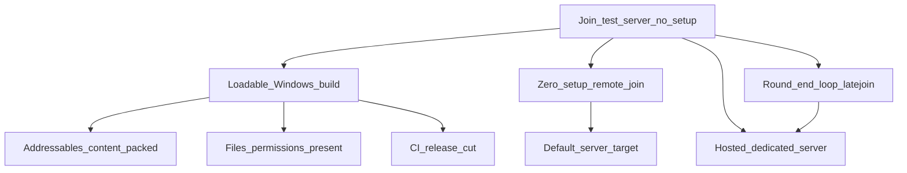

> Goal: A stranger clicks the latest GitHub release link, downloads, and joins the live test server in a few clicks — no config files, no localhost editing, no technical setup
> Status: planned
> Depends on: — (parallel operational track; reuses MVP1 [mvp1-nuke-ops.md](mvp1-nuke-ops.md) M5 round-end loop when it lands, but does not require MVP1 gameplay)
> Current focus: T1 (loadable Windows build), T2 (zero-setup remote join), T3 (session stability — round/connect lifecycle + host/client sync)

# Test server — hop-on/off playtest gate

## Playable definition

An **operational** gate, not a gameplay one: it's what makes everything else actually testable by other people. Done when someone with no involvement in the project can:

- Download the latest build from a single GitHub (pre)release link
- Launch it and have it **fully load** — no missing content, catalogs, or files that leave it stuck
- Join the **hosted** test server by default — pointed at a real server, not `127.0.0.1`, with no manual IP entry
- Play on a server that's actually up, and **stay across rounds** — rounds end and loop back so players hop on/off without a restart
- **Session stability**: round start/stop and connect/disconnect are graceful on both server and client; no gross host-vs-client sync failures that make playtests unusable

This is the piece the CI pipeline was built toward but the *artifact* doesn't yet deliver: the build currently runs but is missing critical files/permissions so it doesn't load, and the shipped launch bats all target `127.0.0.1` (LAN/self-host only), not a public server.

## Dependency tree

Edges mean “needs.” Leaves cite architecture efforts / system maps / design — not full HOW.

- **Loadable build** — the reported failure is "runs but missing critical files/permissions, doesn't load." Prime suspect is **Addressables content not packed into the player build** (this fork is mid-migration to Addressables — [2026-07_addressables-expansion-migration.md](../architecture/2026-07_addressables-expansion-migration.md)): a runtime with no content catalog launches but can't load the world. Needs a real diagnosis against a build (Player.log / the produced zip) — the CI *workflow* is green ([2026-07_ci-develop-release-pipeline.md](../architecture/2026-07_ci-develop-release-pipeline.md); run #3 published a Windows zip), so the gap is in what the artifact contains, not the pipeline.
- **Zero-setup remote join** — the launch bats hardcode `-ip=127.0.0.1` ([`Builds/Start_SS3D_Client_*.bat`](../../Builds/)); a public build must default its connect target to the hosted server (or ship a preconfigured join), so a downloader never edits an IP. The `Launcher` scene is the existing connect surface ([networking-session](../architecture/systems/networking-session.md)).
- **Hosted dedicated server + session stability** — foundations shipped ([2026-07_headless-dedicated-server.md](../architecture/2026-07_headless-dedicated-server.md), [2026-07_session-world-lifecycle.md](../architecture/2026-07_session-world-lifecycle.md)); still **partial**. Done when round start/stop and connect/disconnect are graceful on both sides, remote clients are usable (known drop/selection break is open — [networking-session](../architecture/systems/networking-session.md)), and there are no gross host/client desyncs that invalidate playtests. Smoke harness ([2026-07_multiplayer-test-harness.md](../architecture/2026-07_multiplayer-test-harness.md)) is the regression net.
- **Round-end loop + latejoin** — the same spine MVP1 M5 needs ([round-end.md](../design/round-end.md) §5–§6): end-game screen → restart / return-to-lobby, plus latejoin ([lobby.md](../design/lobby.md) §7). Shared with [mvp1-nuke-ops.md](mvp1-nuke-ops.md) M5.

## Slices

| Id | Name | Status | Links |
|----|------|--------|-------|
| T0 | CI release-cut path | shipped | [2026-07_ci-develop-release-pipeline.md](../architecture/2026-07_ci-develop-release-pipeline.md) (run #3 published a Windows zip) |
| T1 | Loadable build (content + permissions) | pending — **focus**; diagnose against a real build/Player.log first | [2026-07_addressables-expansion-migration.md](../architecture/2026-07_addressables-expansion-migration.md); [data-codegen](../architecture/systems/data-codegen.md) |
| T2 | Zero-setup remote join (default server target) | pending — **focus**; bats hardcode `127.0.0.1` | [networking-session](../architecture/systems/networking-session.md); [networking.md](../design/networking.md); [`Builds/`](../../Builds/) |
| T3 | Session stability (hosted server + round/connect lifecycle + sync) | partial — **focus**; server ships; remote drop/selection + lifecycle polish open | [networking-session](../architecture/systems/networking-session.md); [2026-07_headless-dedicated-server.md](../architecture/2026-07_headless-dedicated-server.md); [2026-07_session-world-lifecycle.md](../architecture/2026-07_session-world-lifecycle.md); [2026-07_multiplayer-test-harness.md](../architecture/2026-07_multiplayer-test-harness.md) |
| T4 | End-game screen + round restart + latejoin | pending — shared with MVP1 M5 | [round-end.md](../design/round-end.md) §5–§6; [lobby.md](../design/lobby.md) §7; [mvp1-nuke-ops.md](mvp1-nuke-ops.md) M5 |
| T5 | Test-server playable close | pending | depends T1–T4 |

## Explicitly deferred

- Player accounts / real authentication ([player-accounts.md](../design/player-accounts.md)) — an unauthenticated ckey is enough for a test server.
- Server browser / matchmaking — one known server via a baked-in target, not a list.
- Auto-deploy of new builds to the host, and persistence across server restarts.
- Windows dedicated-server build / Windows smoke — out of scope per [2026-07_ci-develop-release-pipeline.md](../architecture/2026-07_ci-develop-release-pipeline.md); host on Linux.
- Full lobby visual redesign — a minimal join/spawn path is enough here (the redesign is its own track; see [lobby.md](../design/lobby.md)).

## Maintenance

When child work ships, run `update-system-docs`: bump the slice status here and the header `Current focus`, and refresh [INDEX.md](INDEX.md). Keep T4 in sync with MVP1 M5. Keep T3 as the home for multiplayer session stability (do not duplicate a parallel MVP1 networking slice). Once a build actually loads and connects to a hosted server, promote this gate's status and record the real root cause of the T1 load failure in the relevant system map's **Pitfalls**.
