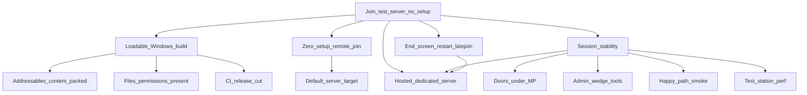

> Goal: A stranger clicks the latest GitHub release link, downloads, and joins the live test server in a few clicks — no config files, no localhost editing, no technical setup
> Status: planned
> Depends on: — (parallel operational track; reuses MVP1 [mvp1-nuke-ops.md](mvp1-nuke-ops.md) M5 round-end loop when it lands, but does not require MVP1 gameplay)
> Current focus: T1 (re-cut Windows after host loopback fix; packaging verified on develop-059e3dd), T2 (zero-setup remote join), T3 (session stability — round/connect lifecycle, doors under MP, admin wedge tools, smoke happy-path, perf floor), T4 (end screen + restart + latejoin)

# Test server — hop-on/off playtest gate

## Playable definition

An **operational** gate, not a gameplay one: it's what makes everything else actually testable by other people. Done when someone with no involvement in the project can:

- Download the latest build from a single GitHub (pre)release link
- Launch it and have it **fully load** — no missing content, catalogs, or files that leave it stuck
- Join the **hosted** test server by default — pointed at a real server, not `127.0.0.1`, with no manual IP entry
- Play on a server that's actually up, and **stay across rounds** — rounds end and loop back so players hop on/off without a restart
- **Session stability**: round start/stop and connect/disconnect are graceful on both server and client; no gross host-vs-client sync failures; **doors/airlocks usable for remote clients**; round-start assignment can’t fail silently; latejoin doesn’t softlock
- Host has **admin wedge tools** when a playtest sticks (force-end round, reassign, teleport disk)
- A **smoke / harness path** covers the Nuke Ops happy path (spawn→fight→breach→arm→end→restart) so merges don’t silently re-break the loop
- The authored **test station stays performant** enough for ~8 players + blast + atmos without hitching the session into unplayability

This is the piece the CI pipeline was built toward but the *artifact* doesn't yet fully deliver: packaging now seeds `Config/` + `Data/Tilemaps/` into player zips (T1), but verify on the next Windows cut; shipped launch bats still target `127.0.0.1` (LAN/self-host only), not a public server (T2).

## Dependency tree

Edges mean “needs.” Leaves cite architecture efforts / system maps / design — not full HOW.

- **Loadable build** — packaging of CWD `Config/` + `Data/Tilemaps/` verified on `develop-059e3dd` (station loads, WorldReady). Separate host bug: empty `ServerAddress` → IPv6 link-local disconnect (see [networking-session](../architecture/systems/networking-session.md) pitfalls); needs a re-cut to confirm playable Host.bat.
- **Zero-setup remote join** — launch bats hardcode `-ip=127.0.0.1` ([`Builds/`](../../Builds/)); public builds must default to the hosted server ([networking-session](../architecture/systems/networking-session.md)).
- **Session stability** — foundations shipped ([2026-07_headless-dedicated-server.md](../architecture/2026-07_headless-dedicated-server.md), [2026-07_session-world-lifecycle.md](../architecture/2026-07_session-world-lifecycle.md)); still **partial**. Covers: graceful round start/stop + connect/disconnect; no silent mind→spawn→loadout failures; remote drop/selection break; **doors/airlocks under MP**; host admin wedge tools; happy-path smoke ([2026-07_multiplayer-test-harness.md](../architecture/2026-07_multiplayer-test-harness.md)); test-station performance floor.
- **End-game screen + restart + latejoin** — shared with MVP1 M5 ([round-end.md](../design/round-end.md) §5–§6; [lobby.md](../design/lobby.md) §7). Latejoin as ghost or late crew must not brick the session; ghosts must still receive the end screen.

## Slices

| Id | Name | Status | Links |
|----|------|--------|-------|
| T0 | CI release-cut path | shipped | [2026-07_ci-develop-release-pipeline.md](../architecture/2026-07_ci-develop-release-pipeline.md) |
| T1 | Loadable build (content + permissions) | partial — Config/Tilemaps packaging verified on `059e3dd`; host loopback fix pending re-cut | [2026-07_ci-develop-release-pipeline.md](../architecture/2026-07_ci-develop-release-pipeline.md); [networking-session](../architecture/systems/networking-session.md) |
| T2 | Zero-setup remote join (default server target) | pending — **focus** | [networking-session](../architecture/systems/networking-session.md); [`Builds/`](../../Builds/) |
| T3 | Session stability (lifecycle, doors under MP, admin wedge, happy-path smoke, perf floor) | partial — **focus** (SS13-scale perf pass shipped; doors/smoke/admin still open) | [networking-session](../architecture/systems/networking-session.md); [furniture](../architecture/systems/furniture.md) (airlocks); [2026-07_metastation-scale-perf.md](../architecture/2026-07_metastation-scale-perf.md); [ingame-console](../architecture/systems/ingame-console.md) / [admin-tools.md](../design/admin-tools.md); [2026-07_multiplayer-test-harness.md](../architecture/2026-07_multiplayer-test-harness.md) |
| T4 | End-game screen + round restart + latejoin (no softlock; spectator sees outcome) | pending — **focus**; shared with MVP1 M5 | [round-end.md](../design/round-end.md) §5–§6; [lobby.md](../design/lobby.md) §7; [mvp1-nuke-ops.md](mvp1-nuke-ops.md) M5 |
| T5 | Test-server playable close | pending | depends T1–T4 |

## Explicitly deferred

- Player accounts / real authentication ([player-accounts.md](../design/player-accounts.md)).
- Server browser / matchmaking.
- Auto-deploy of new builds to the host, and persistence across server restarts.
- Windows dedicated-server build / Windows smoke — host on Linux per CI effort.
- Full lobby visual redesign — minimal join/spawn path is enough ([lobby.md](../design/lobby.md)).

## Maintenance

When child work ships, run `update-system-docs`: bump slice status + header `Current focus`, refresh [INDEX.md](INDEX.md). Keep T4 in sync with MVP1 M5. Keep T3 as the home for multiplayer session stability / doors / admin / smoke / perf (do not duplicate parallel MVP1 networking slices). Record T1 root cause in the relevant system map **Pitfalls** once known.
