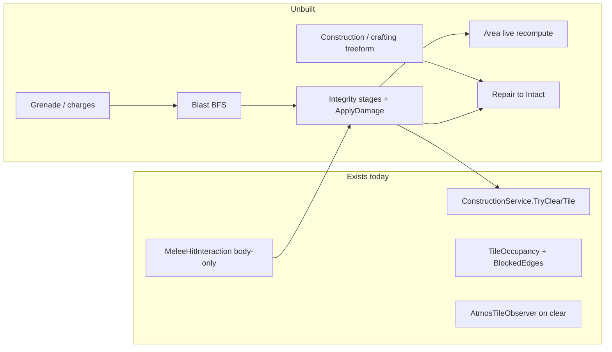

# Station structural damage

## Design authority

| Spec | Role |
|------|------|
| [explosives-destruction.md](Documents/design/explosives-destruction.md) | Primary: Intact → Damaged → Cracked/venting → Destroyed; blast BFS; one Apply path; Area/atmos consequences |
| [construction.md](Documents/design/construction.md) | Repair meets damage **only at Intact/Sealed**; freeform stack is a **prerequisite for Phase 6**; full Framed/Plated ladder and deconstruction stay separate |
| [area.md](Documents/design/area.md) §3 | Local flood-fill recompute on geometry change (today stubbed) |
| [combat.md](Documents/design/combat.md) / [health.md](Documents/design/health.md) | Melee as a damage *source*; blast crew damage reuses limb brute |

**Scope for this effort:** Turf-layer structural objects only (`TileObjectGenericType.Wall` / `Door`, including windows via existing `IsWindow`). Furniture/tables/machines are out.

**Explicitly deferred:** staged build ladder (Open→Framed→Plated→Sealed), deconstruction, deck plating, furniture integrity, floor/ceiling/z-level, balance numbers, explosive crafting recipes. Repair (Phase 6) is in-plan but **blocked** until construction/crafting freeform ships.

---

## Current gaps (why this order)



- Place/clear + atmos refresh exist; **no HP/stages**, **no blast**, **Area `OnTileCleared` is empty** (`// Live boundary recompute deferred`).
- Melee connect only hits `HumanHealthController` ([MeleeHitInteraction.cs](Assets/Scripts/SS3D/Systems/Combat/Interactions/MeleeHitInteraction.cs)).
- Walls/doors live on **Turf** ([TileOccupancyEvaluator.cs](Assets/Scripts/SS3D/Systems/Tile/TileOccupancyEvaluator.cs)).

---

## Recommended phase order

**Integrity before blast.** Blast is “many sources → one Apply”; without stages + Destroyed→clear, explosions have nowhere to land. Melee is the cheapest second source and makes stages playable in Editor without item content.

**Area live recompute ships with Destroyed**, not as a nice-to-have — design §4 is the point of breaching.

**Explosive items before repair.** Grenades/charges only need Phase 3’s blast service — no crafting dependency.

**Repair last, gated on construction/crafting.** Welder + sheets repair (Damaged/Cracked → Intact) needs the Tier-3 freeform combine/use-with + material-stock stack from [construction.md](Documents/design/construction.md) / crafting. That stack is unbuilt (crafting map is condemned; staged ladder unbuilt). Do not invent a one-off repair interaction path ahead of it — Phase 6 waits on that effort, then meets damage only at Intact.

---

## Architecture placement

- New domain folder: `Assets/Scripts/SS3D/Systems/StructuralDamage/` (asmdef under `SS3D.Systems` as usual).
- Entry: `StructuralDamageSubSystem` (or non-networked `SubSystem` + server service) registered via existing SubSystems pattern — **no Boot.unity edits** ([agent-first composition](Documents/architecture/2026-07_agent-first-composition.md)).
- Docs on ship: architecture effort `Documents/architecture/2026-07_structural-destruction.md`, system map `Documents/architecture/systems/structural-destruction.md`, plan under `Documents/plans/`, INDEX coverage row for `explosives-destruction` (via `update-system-docs`).

**Core API (single resolution function):**

```csharp
// Server-only
bool TryApplyStructuralDamage(TileCoord coord, float force, StructuralDamageSource source);
```

All melee, blast hops, and future chemistry/shuttle hooks call this. Thresholds from ScriptableObject / `TileObjectSo` fields (exact numbers deferred — use provisional constants).

**State storage:** Sync integrity stage on the Turf `PlacedTileObject` (NetworkBehaviour already) — enum Intact/Damaged/Cracked/Destroyed. Destroyed immediately clears via `IConstructionService.TryClearTile` rather than leaving a zombie occupant.

**Occupancy hooks:** Extend [TileOccupancyEvaluator](Assets/Scripts/SS3D/Systems/Tile/TileOccupancyEvaluator.cs) (or post-pass) so Cracked walls/doors are **not fully airtight** (Phase 1: `IsAirtight = false` + `NotifyTileStateChanged`; Phase 4 can refine to a slow leak if atmos needs a dedicated leak rate). Damaged = cosmetic occupancy unchanged.

---

## Phase 1 — Integrity core + Destroyed consequences (first ship)

**Goal:** Dev can damage a wall through stages; Destroyed removes Turf structure; atmos refreshes; Area locally recomputes.

1. Stage model + provisional HP thresholds on wall/door/window SOs (or shared profile asset).
2. `StructuralDamageSubSystem.TryApplyStructuralDamage` — accumulate, transition stages, fire events.
3. On Destroyed: `TryClearTile` Turf + spawn placeholder debris item(s) + adjacency refresh (existing path).
4. Implement Area local recompute in [AreaSubSystem.OnTileCleared / OnTileStateChanged](Assets/Scripts/SS3D/Systems/Area/AreaSubSystem.cs) — flood fill only the region touching the changed tile (reuse [AreaFloodFillService](Assets/Scripts/SS3D/Systems/Area/AreaFloodFillService.cs); do not whole-station rebuild).
5. Cracked → update occupancy airtightness + `NotifyTileStateChanged` so atmos/vision consumers refresh.
6. Console/dev: `hurtstructure` (or similar) + optional gizmo/overlay for stage.
7. EditMode tests: threshold crossings, Destroyed clears wall, Cracked flips airtight flag.

**Playable checkpoint:** smash walls via console; sealed room opens to atmos; areas merge when a divider is destroyed.

---

## Phase 2 — Melee / tool structural hits

**Goal:** Harm swings that connect on a wall/door apply structural force (crowbar/hatchet higher than fists).

1. Extend connect resolve in `MeleeHitInteraction`: after (or alongside) body zone resolve, if camera ray hits a structural Turf `PlacedTileObject` within melee range, call `TryApplyStructuralDamage`. Prefer structure when no living zone, or prefer living when both — **prefer living first** (don’t steal combat hits).
2. Profile field for `StructuralForce` on `MeleeWeaponProfile` (fists low, crowbar/welder high).
3. Keep existing combat pitfalls: no collider required to *start* swing; connect uses synced camera ray; Harm exclusive.

**Playable checkpoint:** crowbar a corridor wall through Damaged → Cracked → hole without console.

---

## Phase 3 — Blast BFS resolution

**Goal:** One hop-based resolver per design §2.

1. `BlastResolutionService.Resolve(epicenter, yield, falloff)` — BFS over open adjacency; intact walls/closed doors **block edges**; force spent per hop; terminate when force &lt; useful minimum.
2. Per visited tile: `TryApplyStructuralDamage`; if Destroyed mid-pass, edge opens and traversal may continue (cascade).
3. Characters on tile: reuse `HumanHealthController.ApplyDamage` brute scaled by remaining force (pick a default zone or multi-zone split — provisional: torso).
4. EditMode tests: corridor vs sealed room (force stops at closed door); thin wall reaches Cracked not Destroyed; cascade through destroyed door.

Optional this phase: Effect-tier flash hook if lighting API is ready; else stub event.

---

## Phase 4 — Presentation + Cracked leak polish

**Goal:** World carries the warning (design §1, §7) — no HUD chrome.

1. Visual stages on wall/door meshes (material variants, decals, or cracked mesh swap) — start with wall/window content only; doors as follow-up if art-heavy.
2. Optional hiss/particle at Cracked.
3. If binary `IsAirtight=false` is too harsh, introduce a slow leak path in atmos for Cracked tiles only (document fork until then).
4. Examine strings for damage stage (via existing examine providers).

---

## Phase 5 — Explosive items

**Goal:** Content that only calls Phase 3 (no construction/crafting dependency).

| Item | Behavior |
|------|----------|
| Grenade | Fuse / impact → Resolve at tile |
| Breaching charge | Place on wall/door (use-with), timer, yield tuned to Destroy target tile |
| Timed charge | Free place, visible countdown, defuse interaction |
| Remote detonator | Paired trigger (comms frequency reuse flagged — stub pairing if comms not ready) |

Proximity alert-stack entry when armed charge nears detonation (one HUD touchpoint from design §7).

Breaching-charge / timed-charge **placement** can use a minimal place-on-tile / sticky interaction for this phase; do not wait on the full construction ladder. Defuse is a dedicated interaction against the armed object, not a craft recipe.

---

## Phase 6 — Repair to Intact (gated)

**Prerequisite:** Player-facing construction/crafting freeform stack (Tier-3 combine/use-with, metal sheet stock) must exist. Until that ships, leave Damaged/Cracked walls unrepaired in gameplay (console-only reset is fine for testing).

**Goal:** Damaged/Cracked → Intact via welder + metal sheets (design §3 repair; construction §6 “repair first”).

1. Tier-3 interruptible freeform interactions on damaged structure — reuse the construction effort’s grammar, not Map Editor and not the obsolete Crafting menu.
2. Cannot deconstruct from Damaged/Cracked; must repair to Intact first (deconstruct itself stays with the construction effort).
3. Repair does **not** implement Framed/Plated.

---

## Follow-on (not this plan)

- Construction/crafting freeform foundation (blocks Phase 6) + full [construction.md](Documents/design/construction.md) ladder + deconstruction + deck plating (shares Intact state with this system).
- Furniture/machine housing integrity.
- Chemistry bad-mix → `BlastResolutionService` (one-line integration once Phase 3 exists).
- Shuttle impact / electrical overload as additional sources.

---

## Testing strategy

| Layer | What |
|-------|------|
| EditMode | Stage thresholds, occupancy airtightness, blast BFS geometry, Area local recompute after clear |
| Play Mode / manual | Crowbar wall; sealed room vent; grenade in corridor (Phase 5); repair after construction stack exists (Phase 6) |
| Avoid | Growing `Human.prefab`; Map Editor as player construction UI |

---

## Doc deliverables (per phase ship)

Run `.cursor/skills/update-system-docs/SKILL.md`: map `structural-destruction.md`, INDEX `explosives-destruction` architecture + map columns, tile/area maps note live recompute + integrity hooks, combat map notes structural connect branch.

## Implementation notes

### Phase 1

- Area live recompute is **deferred one Update tick** then full `RefloodAllAreaTilesPreservingMetadata` (not a true local-region flood). Immediate reflood inside `OnTileCleared` would still see the wall because TileMap notifies before removal.
- Debris spawn skipped (log only) until rubble art exists.
- EditMode tests could not be batch-run while the Unity Editor held the project lock; run `./Tools/run_editmode_tests.sh --filter StructuralDamageTests` (and `ClearingDoorBetweenRooms`) after closing the Editor.

